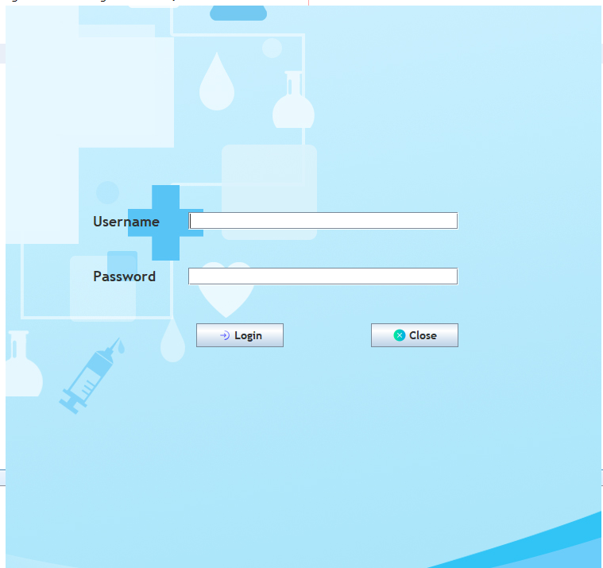
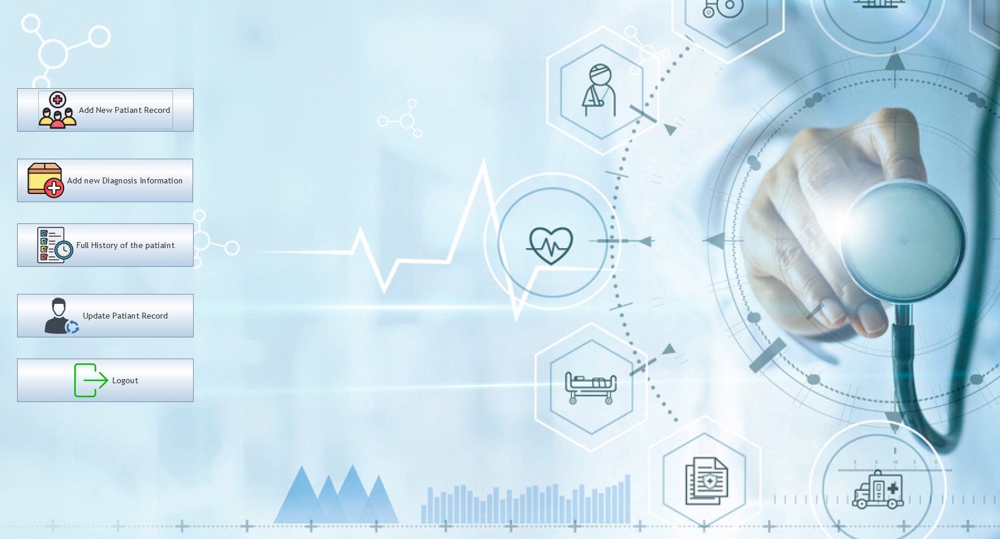
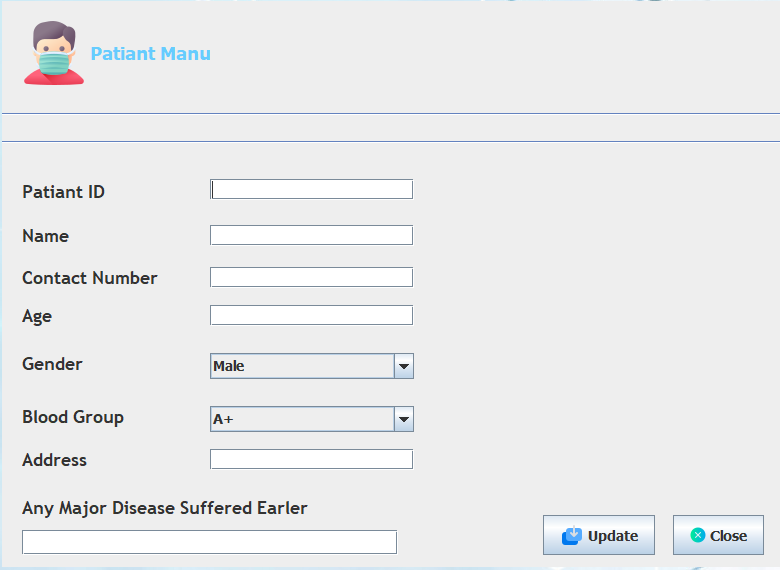
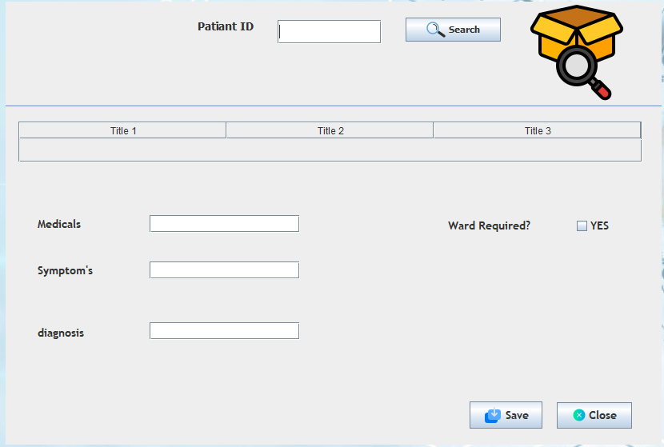
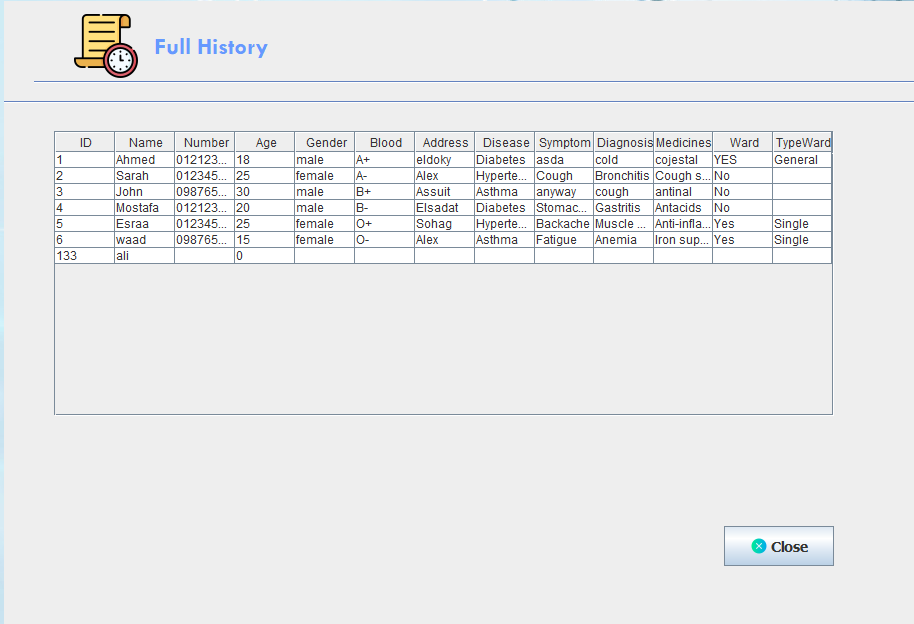
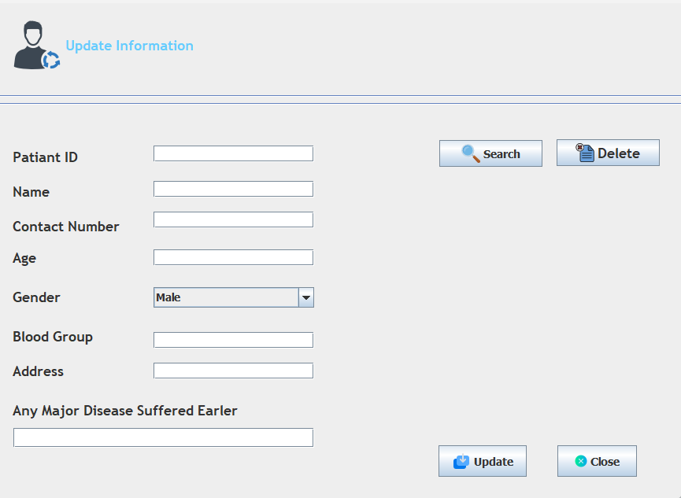

# Hospital Management System

## Introduction
Are you looking for a perfect system? Here we go...

## Table of Contents
1. [System Overview](#system-overview)
2. [User Roles and Permissions](#user-roles-and-permissions)
3. [System Architecture](#system-architecture)
4. [Database Structure](#database-structure)
5. [Functionalities](#functionalities)

## System Overview
The Hospital Management System aims to streamline and automate various processes within a hospital including patient management, diagnosis recording, and administrative tasks. It provides a user-friendly interface for hospital staff to manage patient information, record diagnoses, and update patient details. The system is built using a multi-tier architecture.

## User Roles and Permissions
The system defines two main user roles:
- **Administrator:** Access to administrative functions such as managing users and system settings.
- **Medical Staff:** Access to patient management, diagnosis recording, and updating patient information.

## System Architecture
The system is built using a multi-tier architecture comprising:
1. **Presentation Layer:** User interfaces such as login screens, home page, and forms.
2. **Application Layer:** Business logic and functionalities.
3. **Data Access Layer:** Interaction with the database.

## Database Structure
### Admin Table
- Stores information about the system administrator.
- Fields: `Admin_ID` (Primary Key), `Username`, `Password`.

### Patient Information Table
- Stores details of patients.
- Fields: `P_ID` (Primary Key), `Name`, `Age`, `Gender`, `Contact Info`, `Address`.

### Diagnosis Table
- Records diagnoses, medicines prescribed, and treatment details.
- Fields: `D_ID` (Primary Key), `P_ID` (Foreign Key referencing Patient Information), `Diagnosis`, `Medicine`, `Wrap Type`.

## Functionalities
### Login
- Allows users to authenticate into the system using their credentials.
- Validates username and password against the Admin table.

### Home Page
- Displays essential options for users.
- Buttons: Add New Patient, Add Diagnosis, Update Patient Information, Full History, Log Out.

### Add New Patient
- Enables medical staff to add a new patient to the system.
- Collects patient details such as name, age, gender, contact info, and address.

### Add Diagnosis
- Allows medical staff to record diagnoses, prescribed medicines, wraps, and treatment type for patients.

### Update Patient Information
- Allows medical staff to update patient details such as contact info and address.

## Conclusion
The Hospital Management System streamlines hospital operations, ensuring efficient patient management, accurate diagnosis recording, and improved administrative task handling. With its user-friendly interface and robust functionalities, the system contributes to enhanced healthcare services.

## Screenshots

